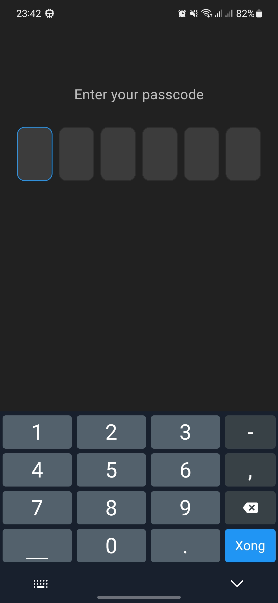
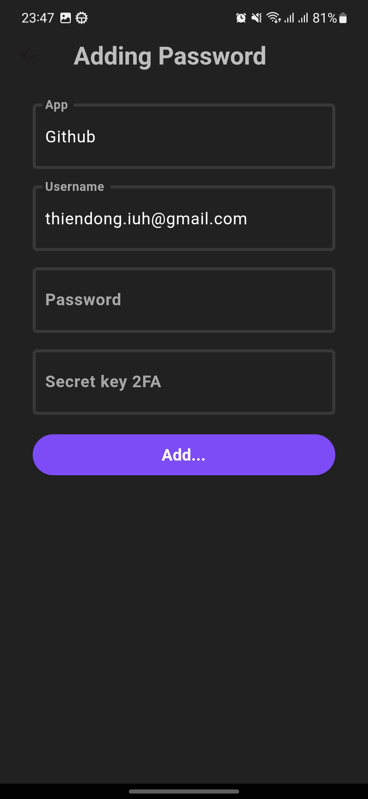
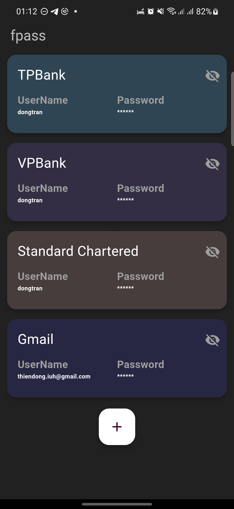
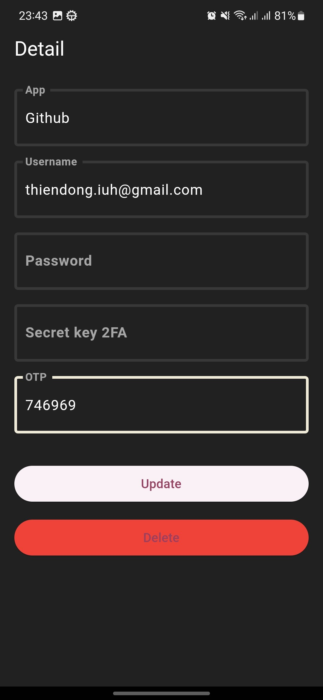

# fpass 🔐

fpass is a mobile application created to securely store and manage passwords and usernames.

The application is developed using Flutter and does not rely on a backend server. Instead, it leverages Firebase Firestore as the database to securely store encrypted password and username data. Prior to being stored in Firestore, both usernames and passwords undergo encryption to bolster security.

## Run project 🚀
- flutter pub get
- flutter run

## Timeline 📅
- ✅ Implement password encryption and decryption, store securely on Firebase
- ✅ Add card detail page
- ✅ Implement Two-Factor Authentication (TOTP)
- ⬜ Add QR code scanning for 2FA
- ⬜ Deploy CHPlay

## Demo 📷

Below is an illustrative image of the project:

 &nbsp; 

&nbsp;

 &nbsp; 

If you need assistance or have any questions, please feel free to contact us.

## License 📝

This project is distributed under the [MIT](https://opensource.org/licenses/MIT) license.